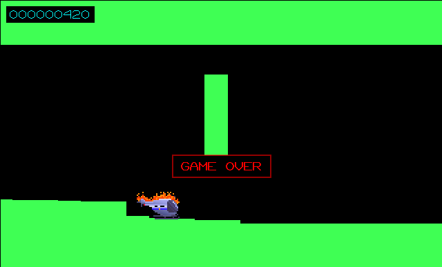

#  HELO

  
## About
HELO is a helicopter game clone created with the LÖVE 2D game engine. In trying to get a feel for the basic LÖVE workflow, I decided to tackle building this project from the ground up. Development for this game is still a work-in-progress.  

All assets, graphics, audio, etc. were created by [paulpls](http://www.github.com/paulpls) unless otherwise stated.
  
**Version:** `alpha`  

## How to Do the Thing
- Install [LÖVE](https://www.love2d.org)
- Clone the repo and `cd` into it
- Run `love .`
  

## Controls
| Key                | Description                               |
|-------------------:|:-----------------------------------------:|
| left mouse button  | Move the helicopter up                    |
| spacebar           | "                                         |
| return             | Restart the game                          |

## To-Do List
See [TODO](TODO.md)

## License
  
    Copyright (C) 2023 Paul Clayberg
    
    This program is free software: you can redistribute it and/or modify
    it under the terms of the GNU General Public License as published by
    the Free Software Foundation, either version 3 of the License, or
    (at your option) any later version.
    
    This program is distributed in the hope that it will be useful,
    but WITHOUT ANY WARRANTY; without even the implied warranty of
    MERCHANTABILITY or FITNESS FOR A PARTICULAR PURPOSE.  See the
    GNU General Public License for more details.
    
    You should have received a copy of the GNU General Public License
    along with this program.  If not, see <https://www.gnu.org/licenses/>.

